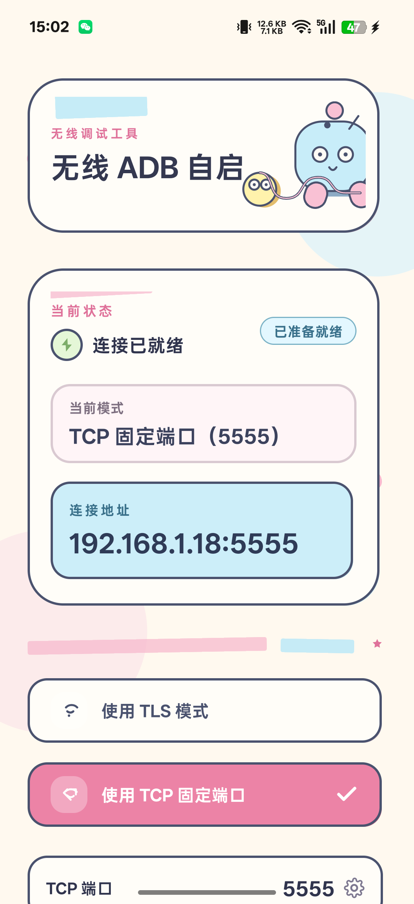

# WirelessAdb-LSPosed

**Language:** [简体中文](README.md) · [Português (Brasil)](README.pt-BR.md) · [English](README.en.md) · [Español](README.es.md)

**LSPosed module**: automatically enables wireless ADB after the first unlock following boot, with the address and logs available on the status screen.

Package name: `dev.wirelessadb.autostart`
Current version: `1.0.18`

<p align="center">
  
</p>

## Features

- **TLS mode**: system Wireless debugging (`adb_wifi_enabled`), random port, pairing required
- **TCP mode**: equivalent to `adb tcpip <port>`, defaulting to `5555`; computers can connect directly with `adb connect IP:5555`
- Monitors Wireless debugging being disabled (TLS only), Wi-Fi recovery, and screen unlock, re-enabling it when necessary
- Automatically copies the address to the clipboard when it changes (waiting for WeChat Input Method cross-device paste to be ready)
- Skips `172.19.*` VPN virtual addresses when retrieving the IP address
- Writes early-boot logs to `Settings.Global`, which can be viewed on the status screen

## Installation

1. Install the Release APK
2. Enable this module in **LSPosed**
3. Select **System Framework** (`android`) as the scope
4. Reboot the phone and complete the first unlock

> Use only on trusted local networks. Switching to TCP restarts `adbd`, which may disconnect the current ADB session.

## Build

```bash
./gradlew :app:assembleRelease
```

Output: `app/build/outputs/apk/release/app-release.apk`

The Android SDK must be configured locally (`sdk.dir` in `local.properties` or the `ANDROID_HOME` environment variable).

## License

MIT
